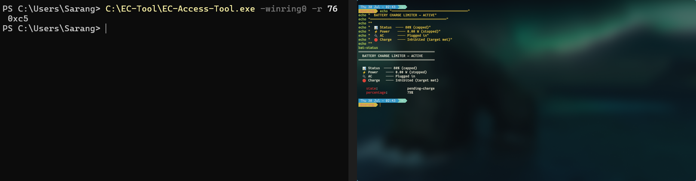
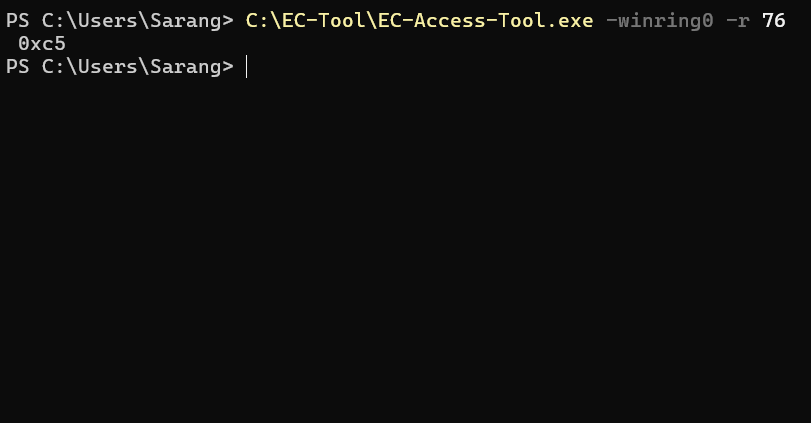
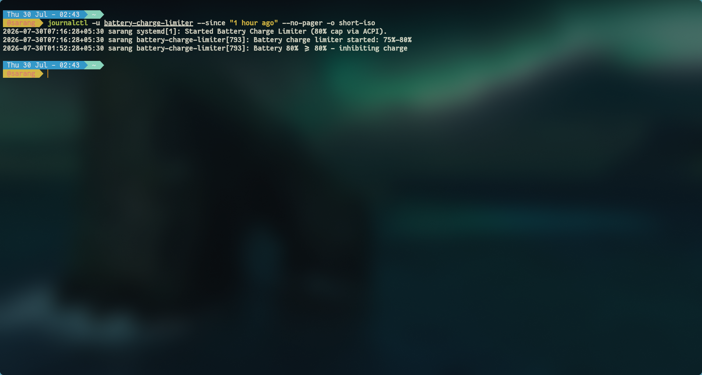

# HP Pavilion Battery Charge Limiter

Reverse engineered battery charge limiting for unsupported HP Pavilion laptops on Windows and Arch Linux.

> **Stop overcharging your laptop battery at the hardware/EC level.**
> Supports Windows and Arch Linux.

| Cross-platform proof (Windows EC readback + Linux daemon) |
|---|
|  |

---

## The Problem

Many consumer HP laptops (including the Pavilion series) do not expose battery charge limit controls, even though the underlying Embedded Controller appears to support the functionality.

This project **re-enables that hidden hardware feature** by writing to the EC register that controls charging.

---

## How It Works

```
Daemon monitors battery % every N seconds
  │
  ├─ ≤75% → Write AUTO (0x40) → resume charging
  └─ ≥80% → Write INHIBIT (0x45) → stop charging
              │
              ▼
         EC Register 0x76 (BDVO)
         AUTO = 0x40, INHIBIT = 0x45
```

**The EC reset problem:** HP Pavilion firmware resets register 0x76 every few seconds. The daemon re-writes continuously to maintain the state.

**Runs automatically:** `setup.ps1` registers a scheduled task (`Battery80Cap`) that launches the daemon at **logon** with hidden window + highest privileges. It survives reboots, works on battery power, and keeps running until you exit it from the tray menu.

---

## Quick Start

| Platform | Guide | One-click setup |
|----------|-------|----------------|
| **Windows** | [windows/GUIDE.md](windows/GUIDE.md) | `dist\BatteryCapSetup.exe` (double-click installer) |
| **Arch Linux** | [arch/GUIDE.md](arch/GUIDE.md) | `sudo bash arch/setup.sh` |
| **Arch (AUR)** | [arch/GUIDE.md](arch/GUIDE.md) | `yay -S battery-charge-limiter` |

---

## Repository Structure

```
Battery-Charge-Limiter/
├── windows/           # Windows: PowerShell daemon, tray icons, setup
│   ├── daemon.ps1     # System tray daemon (3s poll, GUI icons)
│   ├── setup.ps1      # One-click installer (driver, service, task)
│   ├── setup.bat      # Double-click launcher for setup.ps1
│   ├── detect-ec.ps1  # EC register scanner
│   ├── installer/     # Inno Setup source for BatteryCapSetup.exe
│   │   ├── installer.iss      # Compiler script (ISCC)
│   │   ├── postinstall.ps1    # Driver + task + daemon launch
│   │   └── uninstall.ps1      # Cleanup (driver, task, daemon)
│   ├── drivers/       # Vendored EC-Access-Tool + WinRing0 (SHA256 pinned)
│   └── GUIDE.md       # Step-by-step tutorial
│
├── dist/              # Prebuilt installers
│   └── BatteryCapSetup.exe    # Windows double-click installer
│
├── arch/              # Arch Linux: Python daemon, systemd service
│   ├── battery-charge-limiter         # Python daemon (60s poll, headless)
│   ├── battery-charge-limiter.service # systemd unit
│   ├── setup.sh                       # One-click installer
│   ├── detect-ec.sh                   # EC register scanner
│   ├── PKGBUILD                       # AUR package recipe
│   └── GUIDE.md                       # Step-by-step tutorial
│
└── docs/
    ├── GENERIC_GUIDE.md               # "I have a different laptop" guide
    ├── known-registers.md             # Community register database
    ├── config-template.md             # Config templates for any platform
    ├── ec-register-discovery.md       # Legacy discovery guide
    └── screenshots/
```

### Platform Comparison

| Aspect | Windows | Arch Linux |
|--------|---------|------------|
| EC access | WinRing0 → direct EC I/O | acpi_call → ACPI WMI method |
| INHIBIT | Write `0x45` to register `0x76` | `\_SB.WMID.SBCO BUFQ{...}` |
| AUTO | Write `0x40` to register `0x76` | `\_SB.WMID.SBCC BUFQ{...}` |
| Poll interval | 3 seconds (register resets) | 60 seconds (ACPI state is stable) |
| Interface | System tray icon (🟢🔴⚫) | Headless systemd service |
| Visual | NotifyIcon with colored icons | `journalctl -u battery-charge-limiter -f` |

Both paths target the **same EC register (0x76)** — just different access methods.

---

## I Have A Different Laptop

Start here: **[docs/GENERIC_GUIDE.md](docs/GENERIC_GUIDE.md)** — complete walkthrough to find your EC register, test it, and configure the daemon.

Also:
- **[docs/known-registers.md](docs/known-registers.md)** — community database of known registers by model
- **[docs/config-template.md](docs/config-template.md)** — config templates for any laptop
- **Detect scripts:** `windows/detect-ec.ps1` (Windows), `arch/detect-ec.sh` (Linux)

---

## Challenges & Lessons Learned

### EC Firmware Volatility
Register 0x76 resets within seconds on HP Pavilion. Windows daemon re-writes every 3s; Linux uses ACPI path which is more stable (60s poll).

### No Universal Register
Every manufacturer (sometimes every model) uses different registers and values. Discovery is required per device. Detection scripts included for both platforms.

### Driver Signing (Windows)
WinRing0 requires Secure Boot disabled or signed driver. RW-Everything's RwDrv.sys is Microsoft-signed — use that instead.

### PowerShell STA Requirement (Windows)
`-STA` flag required for tray icon. Without it, icon silently fails.

---

## Screenshots

| Cross-platform proof (Windows + Arch) |
|---|
|  |

| Windows — Tray States | Arch — Daemon Logs |
|---|---|
|  |  |

---

## Tested Hardware

The implementation has been verified on:

- HP Pavilion 15-eg3081TU
- Windows 11
- Arch Linux

Both implementations control the same battery charging behaviour using platform-specific interfaces.

Support for additional models is community-driven.


## Contributing

Contributions, bug reports and PRs are always welcome, especially for adding support for new laptop models.

## License

MIT


## AI Disclosure

Parts of the implementation (daemon scripts, installers, PKGBUILD) and portions of the documentation were developed with AI assistance.

The reverse engineering itself, including DSDT analysis, EC register discovery, firmware experimentation, ACPI method identification, validation, and testing, was performed manually.

AI was used as a programming assistant, not as a source of the reverse engineering results.
