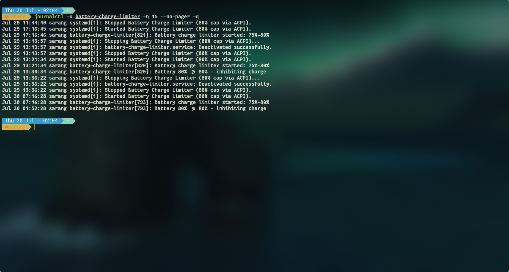

# Battery Charge Limiter

> **Stop overcharging your laptop battery at the hardware/EC level.**
> Supports Windows and Arch Linux.

| Windows EC Proof | Arch — bat-status |
|---|---|
|  |  |

---

## The Problem

Lithium-ion batteries degrade fastest at 100% charge. Premium laptops have "Battery Health Manager" — consumer models (HP Pavilion, etc.) don't, even though the Embedded Controller hardware supports it.

This project **re-enables that hidden hardware feature** by writing to the EC register that controls charging.

---

## How It Works

```
Daemon monitors battery % every N seconds
  │
  ├─ ≤75% → Write AUTO (0x40) → resume charging
  └─ ≥80% → Write INHIBIT (0x45) → stop charging
              │
              ▼
         EC Register 0x76 (BDVO)
         AUTO = 0x40, INHIBIT = 0x45
```

**The EC reset problem:** HP Pavilion firmware resets register 0x76 every few seconds. The daemon re-writes continuously to maintain the state.

---

## Quick Start

| Platform | Guide | One-click setup |
|----------|-------|----------------|
| **Windows** | [windows/GUIDE.md](windows/GUIDE.md) | `powershell -File windows\setup.ps1` (Admin) |
| **Arch Linux** | [arch/GUIDE.md](arch/GUIDE.md) | `sudo bash arch/setup.sh` |

---

## Repository Structure

```
ec-charge-hack/
├── windows/           # Windows: PowerShell daemon, tray icons, setup
│   ├── daemon.ps1     # System tray daemon (3s poll, GUI icons)
│   ├── setup.ps1      # One-click installer
│   ├── detect-ec.ps1  # EC register scanner
│   └── GUIDE.md       # Step-by-step tutorial
│
├── arch/              # Arch Linux: Python daemon, systemd service
│   ├── battery-charge-limiter         # Python daemon (60s poll, headless)
│   ├── battery-charge-limiter.service # systemd unit
│   ├── setup.sh                       # One-click installer
│   ├── detect-ec.sh                   # EC register scanner
│   └── GUIDE.md                       # Step-by-step tutorial
│
└── docs/
    ├── ec-register-discovery.md       # Find registers on any laptop
    └── screenshots/
```

### Platform Comparison

| Aspect | Windows | Arch Linux |
|--------|---------|------------|
| EC access | WinRing0 → direct EC I/O | acpi_call → ACPI WMI method |
| INHIBIT | Write `0x45` to register `0x76` | `\_SB.WMID.SBCO BUFQ{...}` |
| AUTO | Write `0x40` to register `0x76` | `\_SB.WMID.SBCC BUFQ{...}` |
| Poll interval | 3 seconds (register resets) | 60 seconds (ACPI state is stable) |
| Interface | System tray icon (🟢🔴⚫) | Headless systemd service |
| Visual | NotifyIcon with colored icons | `journalctl -u battery-charge-limiter -f` |

Both paths target the **same EC register (0x76)** — just different access methods.

---

## EC Register Discovery

Not all laptops use the same register. See [docs/ec-register-discovery.md](docs/ec-register-discovery.md).

### Known Registers

| Laptop Model | Register | AUTO | INHIBIT | Notes |
|-------------|----------|------|---------|-------|
| HP Pavilion 15-eg3xxx | 0x76 | 0x40 | 0x45 | **This project's target** — volatile |
| HP EliteBook 8xx G6+ | 0xD7 | 0x00 | 0x02 | Stable |
| Lenovo IdeaPad | 0x6A | 0x03 | 0x01 | Tested on some models |
| Dell Latitude | 0x0F | 0x00 | 0x80 | Varies by generation |

---

## Challenges & Lessons Learned

### EC Firmware Volatility
Register 0x76 resets within seconds on HP Pavilion. Windows daemon re-writes every 3s; Linux uses ACPI path which is more stable (60s poll).

### No Universal Register
Every manufacturer (sometimes every model) uses different registers and values. Discovery is required per device. Detection scripts included for both platforms.

### Driver Signing (Windows)
WinRing0 requires Secure Boot disabled or signed driver. RW-Everything's RwDrv.sys is Microsoft-signed — use that instead.

### PowerShell STA Requirement (Windows)
`-STA` flag required for tray icon. Without it, icon silently fails.

---

## Screenshots

| Windows — EC Register | Windows — Tray States |
|---|---|
|  |  |

| Arch — bat-status | Arch — bat-inhibit |
|---|---|
|  |  |

| Arch — daemon active | Arch — journalctl logs |
|---|---|
|  |  |

---

## Disclaimer

This writes directly to your laptop's Embedded Controller registers. Hardware-level operation with risks. Tested on HP Pavilion 15-eg3xxx only. Use at your own risk.

## License

MIT
