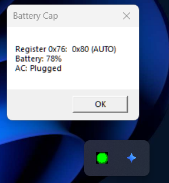

# Battery Charge Limiter

> **Stop overcharging your laptop battery at the hardware/EC level.**
> Supports Windows (WinRing0) and Linux (Arch) with system tray daemon.


## The Problem

Lithium-ion batteries degrade fastest when kept at 100% charge. Most premium laptops include a "Battery Health Manager" or "Charge Limit" option in their BIOS — but **consumer-grade laptops (HP Pavilion, Lenovo IdeaPad, etc.) often ship without this feature**, even though the Embedded Controller hardware supports it.

This project **re-enables that hidden hardware feature** by writing directly to the Embedded Controller (EC) register that controls battery charging.

## How It Works

```
┌─────────────────────────────────────────────────────────┐
│                    System Tray Daemon                    │
│  ┌──────────┐  powershell -STA daemon.ps1               │
│  │   Timer  │── Every 3 seconds ──────────────────┐     │
│  │  (3 sec) │                                      ▼     │
│  └──────────┘                               ┌──────────┐│
│       │                                      │ WMI Query││
│       │       ┌──────────────────────┐       │ Win32_   ││
│       ├──────►│ Battery < 80% ?      │◄──────┤ Battery  ││
│       │       └──────────┬───────────┘       │ (charge%,││
│       │                  │                    │ status)  ││
│       │                  ▼ yes                └──────────┘│
│       │       ┌──────────────────────┐                    │
│       │       │ Write EC: AUTO (0x40)│──► Green icon      │
│       │       └──────────────────────┘                    │
│       │                  │                                │
│       │                  ▼ no                             │
│       │       ┌──────────────────────┐                    │
│       │       │ Write EC: INHIBIT     │──► Red icon       │
│       │       │ (0x45)               │                    │
│       │       └──────────────────────┘                    │
│       │                                                    │
│       │  ┌─────────────────────────────────────────────┐  │
│       │  │ If not charging → Gray icon (discharging)   │  │
│       │  └─────────────────────────────────────────────┘  │
└─────────────────────────────────────────────────────────┘
                         │
                         ▼
              ┌──────────────────────┐
              │  EC Register (0x76)  │
              │  ┌─────┬──────┐     │
              │  │0x40 │ AUTO │     │
              │  │0x45 │INHIBIT│    │
              │  └─────┴──────┘     │
              │  [Volatile — EC     │
              │   firmware resets   │
              │   every few secs]   │
              └──────────────────────┘
```

### The EC Firmware Reset Problem

On HP Pavilion 15-eg3xxx, writing the inhibit value (0x45) to register 0x76 stops charging immediately — **but the EC firmware resets this register back to AUTO (0x80) every few seconds.** 

**Solution:** The daemon re-writes the inhibit value every **3 seconds** to maintain the stopped state. This runs continuously in the background with minimal CPU usage (~0.1%).

---

## Icon Legend

| Icon | State | Meaning |
|------|-------|---------|
| 🟢 Green | Charging | Battery < 80%, charger plugged → charging allowed |
| 🔴 Red | Inhibited | Battery ≥ 80%, charger plugged → charging stopped |
| ⚫ Gray | Discharging | Charger unplugged → battery draining naturally |

---

## Windows Setup

Full step-by-step guide with all the "why" and "what if it breaks" details → **[windows/GUIDE.md](windows/GUIDE.md)**

**Quick start (if you know what you're doing):**

```powershell
# Run as Administrator
powershell -ExecutionPolicy Bypass -File windows\setup.ps1
```

### File Structure

```
ec-charge-hack/
├── README.md                          # Main documentation
├── .gitignore                         # Ignores .exe/.sys/.dll binaries
│
├── windows/                           # ─── Windows implementation ───
│   ├── daemon.ps1                     # Main tray daemon (the brain)
│   │   └── Run: powershell -STA -WindowStyle Hidden -File daemon.ps1
│   │
│   ├── setup.ps1                      # One-click installer
│   │   └── Run as Admin → installs driver, copies files, creates task
│   │
│   ├── detect-ec.ps1                  # EC register scanner
│   │   └── Helps find charge control register on other laptops
│   │
│   ├── GUIDE.md                       # Step-by-step tutorial + troubleshooting
│   │
│   └── icons/                         # 16x16 colored tray icons
│       ├── green.ico                  # Charging allowed (< threshold)
│       ├── red.ico                    # Charging inhibited (at threshold)
│       └── gray.ico                   # Discharging (unplugged)
│
├── arch/                              # ─── Linux/Arch implementation ───
│   └── (add your code here)
│
└── docs/                              # ─── Documentation ───
    ├── ec-register-discovery.md       # How to find registers on any laptop
    └── screenshots/                   # GitHub README images
        ├── 01-terminal-proof.png
        └── 02-tray-icons.png
```

### Where Files Go On Your System

| File (in repo) | Copy to | Why |
|----------------|---------|-----|
| `windows/daemon.ps1` | `C:\EC-Tool\daemon.ps1` | Scheduled task runs from here |
| `windows/icons/*.ico` | `C:\EC-Tool\` | Daemon loads icons from same folder |
| `—` | `C:\EC-Tool\EC-Access-Tool.exe` | Download separately, needed for EC access |
| `—` | `C:\EC-Tool\WinRing0x64.sys` | Download separately, kernel driver |
| `windows/setup.ps1` | Run from anywhere | Handles all of the above automatically |

### Configuration

Edit these variables at the top of `daemon.ps1`:

```powershell
$ecTool     = "C:\EC-Tool\EC-Access-Tool.exe"
$regAddr    = "76"        # EC register (hex, without 0x)
$autoVal    = "00"        # AUTO — stock EC behavior (charges, LED follows system)
$inhibitVal = "45"        # INHIBIT — stops charge, RED LED, AC online
$stopAt     = 80           # Target charge limit (%)
```

---

## Linux (Arch) Setup

> *(Your implementation goes here — drop your code in the [arch/](arch/) folder)*

Same concept, different platform. Uses `/dev/port`, `ec_sys`, or `acpi_call` instead of WinRing0.

---

## EC Register Discovery

**Not all laptops use the same register.** If yours differs:

1. Install RW-Everything or use `detect-ec.ps1`
2. Scan registers while plugging/unplugging AC
3. Identify which register value changes with charge state
4. Test writing candidate values
5. Update the daemon configuration

See [docs/ec-register-discovery.md](docs/ec-register-discovery.md) for a detailed guide.

### Known Registers

| Laptop Model | Register | AUTO Value | INHIBIT Value | Notes |
|-------------|----------|------------|---------------|-------|
| HP Pavilion 15-eg3xxx | 0x76 | 0x40 | 0x45 | **This project's target** — EC firmware is volatile |
| HP EliteBook 8xx G6+ | 0xD7 | 0x00 | 0x02 | More stable, no re-write needed |
| Lenovo IdeaPad | 0x6A | 0x03 | 0x01 | Tested on some models |
| Dell Latitude | 0x0F | 0x00 | 0x80 | Varies by generation |

---

## Challenges & Lessons Learned

### 1. EC Firmware Volatility
The HP Pavilion's EC firmware resets the BDVO register (0x76) within seconds. Writing 0x45 works momentarily, then reverts.

**Solution:** Continuous re-write every 3 seconds via timer.

### 2. HP BIOS Hides the Feature
HP's WMI interface (`root\hp\instrumentedbios`) exposes "Adaptive Battery Extender" but NOT a configurable charge limit. The hardware register is accessible even though the BIOS hides the UI.

### 3. WinRing0 Driver
- Requires Secure Boot to be disabled or the driver to be signed
- Windows Defender flags it (add exclusion)
- Must run with Administrator privileges for `-install`

### 4. PowerShell STA Requirement
Windows.Forms NotifyIcon requires Single-Threaded Apartment (-STA). The system tray icon won't appear without it, even though no error is thrown.

### 5. WMI vs EC Readings
`Get-WmiObject Win32_Battery` reports charge level and status, but the EC register is the ground truth. Always verify both.

### 6. No Universal Register
Every laptop manufacturer (and sometimes each model) uses a different EC register and different values. There is no "one size fits all" — discovery is required per device.

---

## Screenshots

| EC Register Proof | Tray Icons | Green Tray |
|-------------------|------------|------------|
|  |  |  |

---

## Disclaimer

This project writes directly to your laptop's Embedded Controller (EC) registers.
This is a hardware-level operation with potential risks including system instability
or unexpected behavior. Tested on HP Pavilion 15-eg3xxx only. Other laptops require
register discovery before use.

The author assumes no liability for any damages. Use at your own risk.

## License

MIT — go wild. Tinker with EC registers at your own risk. No warranty, no liability.
